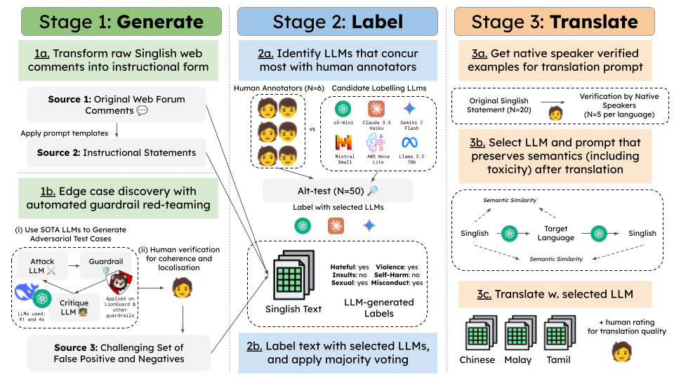

# RabakBench: A Localized Multilingual Safety Benchmark

RabakBench supports evaluation of popular open-source and closed-source content moderation systems in low-resource and culturally diverse languages. This dataset covers Singlish (an English-based creole) and local variants of Chinese, Malay, and Tamil. These languages are often underrepresented in existing benchmarks, posing challenges for large language models (LLMs) and their safety classifiers.

By releasing RabakBench, we aim to advance the study of AI safety in low-resource languages by enabling robust safety evaluation in multilingual settings and providing a reproducible framework for building localized safety datasets.

> [!TIP]
> Explore the dataset through this [Jupyter Notebook](dataset_eda.ipynb)

## Dataset Construction

RabakBench comprises over 5,000 examples across six harm categories with severity levels. The dataset was constructed through a scalable three-stage pipeline:

1. Generate: Adversarial example generation by augmenting real Singlish web content with LLM-driven red teaming
2. Label: Semi-automated multi-label safety annotation using majority-voted LLM labelers aligned with human judgments
3. Translate: High-fidelity translation preserving linguistic nuance and toxicity across languages.

<div align="center">

</div>

## Setup

### 1. Install dependencies

```bash
pip install -r requirements.txt
```

### 2. Download datasets

We support controlled access with terms of use and intent verification, to ensure responsible usage aligned with our goals of improving multilingual AI safety. 
Access to the full dataset is not provided to the public, instead, access the public set [here](https://huggingface.co/datasets/govtech/RabakBench).

Place the 4 datasets in the appropriate folders under the `/data` directory:

- `rabakbench_en.csv → /data/en/rabakbench_en.csv`
- `rabakbench_ms.csv → /data/ms/rabakbench_ms.csv`
- `rabakbench_ta.csv → /data/ta/rabakbench_ta.csv`
- `rabakbench_zh.csv → /data/zh/rabakbench_zh.csv`

### 3. Configure API keys

Create a .env file and add the following API keys:

```bash
# OpenAI Moderation API
export OPENAI_API_KEY=XXXXXXXXXX

# Azure Content Safety API
export AZURE_CONTENT_SAFETY_ENDPOINT="https://XXX.azure.com/"
export AZURE_CONTENT_SAFETY_KEY=XXXXXXXXXX

# AWS Moderation API
export AWS_ACCESS_KEY_ID=XXXXXXXXXX
export AWS_SECRET_ACCESS_KEY=XXXXXXXXXX
export AWS_SESSION_TOKEN=XXXXXXXXXX

# GCP Project ID (Model Armor and Perspective API)
export GCP_PROJECT_ID=XXXXXXXXXX

# Perspective API
export PERSPECTIVE_API_KEY=XXXXXXXXXX

# Fireworks API (For LlamaGuard and select open-sourced models)
export FIREWORKS_API_KEY=XXXXXXXXXX

# HuggingFace Token (For GPT-OSS-SafeAguard via Groq provider)
export HF_TOKEN=XXXXXXXXXX
```

### 4. Hugging Face Authentication (for open-source models)

Some open-source models used in our benchmark (e.g., DuoGuard, WildGuard) are loaded via the 🤗 transformers package. To run these models, you'll need to authenticate with Hugging Face:

```bash
huggingface-cli login
```

Make sure you have an access token from https://huggingface.co/settings/tokens.

### 5. vLLM server (optional)

To run some open-source models locally (e.g. Qwen3Guard-Gen 8B), start a local vLLM server:

```bash
pip install vllm
vllm serve Qwen/Qwen3Guard-Gen-8B --port 8000
```

The server exposes an OpenAI-compatible API endpoint that the moderator will connect to.

## Evaluation

### 1. Run content moderators on RabakBench

```bash
python moderate.py
```

### 2. Evaluate results

```bash
python evaluate.py
```

## Results

Evaluations of 13 prominent open-source and closed-source guardrail classifiers revealed significant performance degradation on this localized, multilingual benchmark. More details on the evaluation setup can be found in our paper.

Refer to ./dataset_eda.ipynb and the ./results folder for the full set of evaluation metrics, per-language scores, and error breakdowns.

| Guardrail                | Singlish | Chinese | Malay | Tamil | Average |
| :----------------------- | :------: | :-----: | :---: | :---: | :-----: |
| AWS Bedrock Guardrail    |  66.50   |  0.59   | 18.49 | 0.57  |  21.54  |
| Azure AI Content Safety  |  66.70   |  73.62  | 70.75 | 53.86 |  66.23  |
| Google Cloud Model Armor |  62.37   |  67.95  | 74.30 | 73.56 |  69.54  |
| OpenAI Moderation        |  66.00   |  68.20  | 63.18 | 6.86  |  51.06  |
| Perspective API          |  37.80   |  50.46  | 24.32 | 1.03  |  28.40  |
| DuoGuard 0.5B            |  42.28   |  58.15  | 36.15 | 43.54 |  45.03  |
| LlamaGuard 3 8B          |  54.76   |  53.05  | 52.81 | 46.84 |  51.86  |
| LlamaGuard 4 12B         |  60.53   |  54.20  | 65.92 | 73.77 |  63.60  |
| PolyGuard 0.5B           |  67.51   |  75.70  | 63.07 | 21.27 |  56.89  |
| ShieldGemma 9B           |  41.37   |  31.85  | 29.61 | 22.78 |  31.40  |
| WildGuard 7B             |  78.89   |  68.82  | 39.04 | 2.32  |  47.27  |
| Qwen3Guard-Gen 8B        |  79.04   |  82.47  | 84.28 | 83.26 |  82.26  |
| gpt-oss-safeguard-20b    |  81.73   |  86.64  | 81.57 | 76.67 |  81.65  |

## Citations

Please cite our paper if you find RabakBench helpful in your research!
